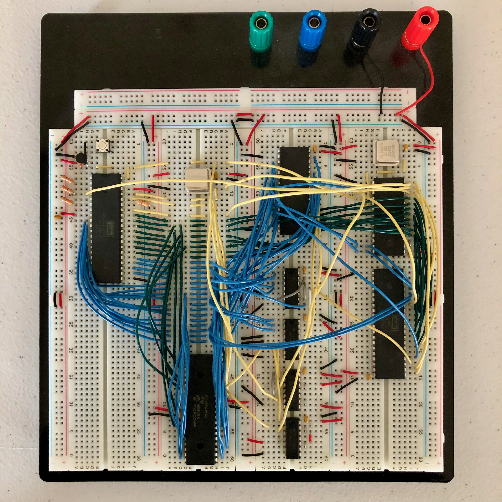

# Kit-1 8-bit Computer

**Kit-1** is a homebrew 8-bit computer built around the **WDC 65C02** microprocessor.

The project combines custom hardware, 65C02 assembly software, microcontroller firmware, removable storage, and host-side simulation into a complete small-computer architecture. The system runs at **5 MHz**, provides **64 KiB of SRAM**, supports serial communications and general-purpose I/O, and boots software from a microSD card.

A **PIC18F47K40** microcontroller implements a "Virtual ROM" that loads the system BIOS directly into RAM during reset and then removes itself from the processor bus. This allows the 65C02 to use essentially the entire 64 KiB address space as RAM while retaining ROM-like bootstrap behavior.



## System Overview

The Kit-1 combines several classic components of a 65xx computer with a microcontroller-assisted boot architecture:

| Component | Implementation |
| --- | --- |
| CPU | WDC 65C02 |
| Clock | 5 MHz |
| Memory | 64 KiB SRAM |
| Serial I/O | 65C51 ACIA |
| GPIO | 65C22 VIA |
| Storage | microSD via 65C22 VIA |
| Bootstrap | PIC18F47K40 Virtual ROM |
| Firmware | KitBIOS |
| Fallback interface | ROM monitor |

At a high level:

```text
                         ┌─────────────────┐
                         │     65C02       │
                         │      CPU        │
                         └────────┬────────┘
                                  │
                     Address / Data / Control Bus
                                  │
          ┌───────────────┬───────┴───────┬────────────────┐
          │               │               │                │
          ▼               ▼               ▼                ▼
   ┌────────────┐   ┌───────────┐   ┌───────────┐   ┌─────────────┐
   │ 64 KiB RAM │   │  65C51    │   │   65C22   │   │ PIC18F47K40│
   │            │   │   ACIA    │   │    VIA    │   │ Virtual ROM│
   └────────────┘   └─────┬─────┘   └─────┬─────┘   └─────────────┘
                          │               │
                          ▼          ┌────┴────┐
                       Serial       │         │
                                   ▼         ▼
                                 GPIO     microSD
```

The project therefore encompasses both the physical architecture of an 8-bit computer and the software required to bootstrap and operate it.

## Design Goals

Kit-1 explores the design of a complete microcomputer from the processor bus upward.

The system demonstrates:

- 65C02 processor architecture
- address and data bus interfacing
- memory-system design
- memory-mapped peripheral I/O
- serial communications
- parallel GPIO
- removable mass storage
- microcontroller/CPU bus interaction
- bootstrap and reset sequencing
- 65C02 assembly-language programming
- embedded C firmware
- cross-platform build tooling
- hardware-independent BIOS testing through simulation

The result is not simply a 65C02 development board, but a small computer with a defined boot process and supporting firmware.

# Hardware Architecture

## 65C02 CPU

The system is built around the **65C02**, the CMOS successor to the MOS Technology 6502. Kit-1 operates the processor at 5 MHz. The CPU communicates with RAM and peripheral devices through the conventional 65xx address, data, and control buses.

## Memory

Kit-1 contains 64 KiB SRAM. A conventional 65C02 system normally reserves part of its 64 KiB address space for ROM containing startup firmware.

Kit-1 takes a different approach.

Instead of permanently mapping a ROM device into the CPU address space, the system uses a microcontroller to copy the BIOS into RAM while the processor is held in reset. Once the copy is complete, the microcontroller releases the bus.

This provides ROM-style bootstrapping without requiring the bootstrap device to remain mapped into the processor's address space during normal operation.

# Virtual ROM

One of the distinguishing features of Kit-1 is its **Virtual ROM**. The Virtual ROM is implemented with a **PIC18F47K40** microcontroller. During normal execution the 65C02 sees its BIOS in RAM. The PIC is needed only during the initial bootstrap process.

Conceptually, startup occurs as follows:

```text
Power On / Hard Reset
          │
          ▼
┌───────────────────────┐
│ PIC holds system in   │
│ reset                 │
└───────────┬───────────┘
            │
            ▼
┌───────────────────────┐
│ PIC gains control of  │
│ system bus            │
└───────────┬───────────┘
            │
            ▼
┌───────────────────────┐
│ Copy KitBIOS image    │
│ into upper RAM        │
└───────────┬───────────┘
            │
            ▼
┌───────────────────────┐
│ PIC releases bus      │
│ and enters sleep      │
└───────────┬───────────┘
            │
            ▼
┌───────────────────────┐
│ Release 65C02 reset   │
└───────────┬───────────┘
            │
            ▼
       KitBIOS starts
```

From the 65C02's perspective, the BIOS is available at the expected addresses when reset ends.

The bootstrap hardware itself no longer needs to participate in normal CPU operation.

# Peripheral Architecture

## Serial Interface

Serial communications are provided by a **65C51 ACIA**. The ACIA provides the computer's asynchronous serial interface and allows KitBIOS and the ROM monitor to communicate with an external terminal.

## Versatile Interface Adapter

A **65C22 VIA** provides two 8-bit parallel I/O ports.

Kit-1 divides those resources between two functions:

```text
65C22 VIA
    │
    ├── 8-bit GPIO
    │
    └── microSD interface
```

Half of the VIA is available as a general-purpose 8-bit I/O port, while the remaining portion supports communication with the microSD card.

## microSD Storage

Kit-1 uses a microSD card as removable storage.

At boot, KitBIOS searches the card for the operating-system image. The SD card uses a **FAT16** filesystem, allowing the boot image to be prepared on a conventional computer and then transferred to the Kit-1.

# Boot Process

After the Virtual ROM has copied KitBIOS into RAM and released the processor, KitBIOS initializes the system peripherals.

The boot sequence then proceeds approximately as follows:

```text
            Reset
              │
              ▼
      Virtual ROM loads
       KitBIOS into RAM
              │
              ▼
         Start KitBIOS
              │
              ▼
     Initialize hardware
              │
              ▼
       Search microSD
              │
              ▼
       KitOS available?
          /         \
        yes          no
         │            │
         ▼            ▼
     Load KitOS    Start ROM
                    Monitor
```

If a valid KitOS image is available on the SD card, KitBIOS can transfer control to it. If no valid image is found, KitBIOS falls back to its built-in ROM monitor. This provides a usable recovery and development environment even when bootable removable media is unavailable.

# KitBIOS

**KitBIOS** provides the low-level firmware required to initialize and operate the machine.

Its responsibilities include:

- system startup
- peripheral initialization
- serial communications
- microSD access
- operating-system discovery
- operating-system bootstrap
- ROM-monitor fallback

The BIOS is written for the 65C02 and is built into a binary image that the Virtual ROM firmware embeds and transfers into system RAM during startup.

# ROM Monitor

If KitBIOS cannot locate a valid KitOS image, the machine starts its built-in monitor. A monitor provides a minimal interactive environment useful for:

- inspecting memory
- modifying memory
- debugging software
- interacting with the machine without a full operating system
- testing hardware and low-level firmware

This makes the monitor both a fallback environment and a useful development tool.

# Build System

The repository uses a top-level `Makefile` to coordinate the different parts of the system.

The normal build process constructs:

```text
bin2c
  │
  ├──► KitBIOS
  │
  └──► KitBIOS binary → C source
                         │
                         ▼
                       KitROM
```

The build therefore crosses multiple software domains:

1. Build the host-side `bin2c` utility.
2. Assemble/build KitBIOS into a binary image.
3. Convert the BIOS binary into C data.
4. Incorporate that data into the PIC Virtual ROM firmware.
5. Build the PIC firmware.

This ensures that the Virtual ROM contains the same BIOS image produced by the current source tree.

## Building

From the project root:

```bash
make
```

The top-level build generates the host utility, KitBIOS, and Virtual ROM firmware.

To remove generated build products:

```bash
make clean
```

# Programming the Hardware

After building the project:

1. Program the **PIC18F47K40** with the generated Virtual ROM firmware.
2. Prepare a microSD card with a **FAT16** partition.
3. Copy the KitOS image to the root directory of the SD card.
4. Insert the card into the Kit-1.
5. Power on or reset the computer.

The Virtual ROM will load KitBIOS into RAM before releasing the 65C02. KitBIOS then initializes the machine and attempts to boot KitOS from the SD card.

# Simulation

KitBIOS can also be built and tested without physical Kit-1 hardware. The repository supports the **py65** 65C02 simulator and monitor.

Build the simulator version of the BIOS with:

```bash
make sim
```

Then launch it with:

```bash
./simulate.sh
```

The simulation invokes `py65mon` in 65C02 mode and loads both the simulated BIOS and an SD-card image. This provides a useful development path for testing low-level software independently of the physical computer.

Conceptually:

```text
                 KitBIOS Source
                       │
              ┌────────┴────────┐
              │                 │
              ▼                 ▼
       Hardware Build      Simulator Build
              │                 │
              ▼                 ▼
       65C02 + Kit-1         py65mon
          hardware             65C02
```

Separating BIOS development from physical hardware testing reduces the feedback loop when working on system software and allows portions of the machine to be debugged from a conventional development environment.

# Design Highlights

Kit-1 brings together several areas of computer engineering and low-level software development.

**Computer architecture**  
The project implements a complete small computer around a 65C02 CPU rather than using a microcontroller as the primary processor.

**Hardware/software co-design**  
The bootstrap architecture depends on coordinated behavior between the 65C02 system hardware, PIC firmware, BIOS image, and build system.

**Bus-level interfacing**  
The Virtual ROM must interact with the processor's memory bus during reset and then relinquish control for normal operation.

**Memory architecture**  
Loading firmware into SRAM at startup avoids permanently dedicating part of the 65C02's limited 64 KiB address space to physical ROM.

**Embedded firmware**  
A PIC18F47K40 implements the bootstrap hardware behavior required to initialize the 65C02 system.

**Assembly-language system software**  
KitBIOS provides the low-level software environment required to initialize peripherals and bootstrap higher-level software.

**Peripheral integration**  
The machine integrates serial communications, parallel I/O, and removable storage using classic 65xx peripheral devices.

**Bootloader design**  
Startup progresses through multiple stages: Virtual ROM, KitBIOS, removable-media discovery, and finally either KitOS or the monitor.

**Build automation**  
The build system connects host-side tools, 65C02 software, generated C source, and PIC firmware into a single workflow.

**Simulation and hardware-independent testing**  
The py65 workflow provides a means of exercising BIOS code without requiring the physical computer for every development iteration.

# Why Build an 8-bit Computer?

Kit-1 is intentionally based on a comparatively simple processor architecture.

A system such as the 65C02 makes normally hidden computer operations visible:

```text
CPU
 │
 ├── address decoding
 ├── memory reads and writes
 ├── interrupt handling
 ├── stack operations
 ├── memory-mapped I/O
 ├── serial communications
 ├── storage protocols
 └── bootstrap sequencing
```

Modern systems still depend on these concepts, but layers of abstraction normally hide them from application software.

Building a small computer from discrete processor, memory, peripheral, and microcontroller components provides a direct way to explore how hardware and software cooperate to create a functioning computing system.

# Status

Kit-1 is a personal computer-engineering project originally developed in 2019.

The repository contains the firmware, BIOS, supporting utilities, simulation environment, and documentation associated with the system.

# License

Software and firmware in this repository are licensed under the [Apache License 2.0](LICENSES/Apache-2.0.txt).

Hardware design files and schematics are licensed under the [CERN Open Hardware License Version 2 – Permissive (CERN-OHL-P-2.0)](LICENSES/CERN-OHL-P-2.0.txt).

Copyright © 2019 Ryan Clarke
