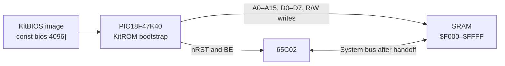

# KitROM

**KitROM** is the PIC-based bootstrap firmware for the Kit-1 8-bit computer.
It implements a **Virtual ROM**: a PIC18F47K40 temporarily takes ownership of
the 65C02 system bus, copies an embedded KitBIOS image into SRAM, releases the
bus and reset controls, and enters sleep.

The BIOS subsequently executes from SRAM. KitROM supplies the initial memory
contents without serving ROM reads during normal CPU operation.

## Architecture



KitROM and KitBIOS have separate execution environments:

| Component | Executes on | Responsibility in this source |
| --- | --- | --- |
| KitROM | PIC18F47K40 | Initialize GPIO, acquire the bus, install the BIOS, release the bus, sleep |
| Embedded KitBIOS | 65C02 after handoff | BIOS machine-code payload copied into SRAM |
| Kit-1 hardware | Board circuitry | Connect the buses and control signals and provide the CPU clock and SRAM control path |

The source drives `R/W` as its write control. It does not define separate SRAM
chip-select, output-enable, or write-enable GPIO signals.

## Bootstrap Sequence

`main.c` performs the sequence in this order:

1. Write `0xFF` to `PMD0` through `PMD5` to disable peripherals. Configure
   PORTA, PORTC, and PORTD as digital buses and RE0–RE2 as digital controls.
2. Set `ODCONE = 0x03`, enabling open-drain operation on RE0 and RE1.
   Initialize `nRST` and `BE` to 1 and make them outputs. Keep `R/W` and the
   address/data buses as inputs initially.
3. Drive `nRST` low, then `BE` low. Preload `R/W` high and address/data values
   to zero before changing those pins to outputs.
4. Load `addr = bios_start` and `i = 0`. For each byte, drive the low and high
   address ports, drive `bios[i]`, pulse `R/W` low for the requested delay,
   then return `R/W` high and increment both counters.
5. Disconnect in this order: data bus, high address bus, low address bus,
   then `R/W`, by setting their direction registers to inputs.
6. Set `BE` to 1, then `nRST` to 1, and call `Sleep()`.

For the two open-drain controls, a value of 1 releases the line; it does not
actively drive a high level. The hardware must provide the appropriate high
level. Bus outputs become inputs before the CPU is released, making bus
ownership an explicit part of the handoff.

## GPIO and Bus Mapping

The logical mapping is defined in `src/system_config.h`.

| PIC GPIO | Kit-1 signal | Firmware behavior |
| --- | --- | --- |
| RE0 | `nRST` | Open-drain, active-low CPU reset control |
| RE1 | `BE` | Open-drain bus-enable control; low during loading |
| RE2 | `R/W` (`RW`) | Output during loading; low write pulse; input after handoff |
| RA0–RA7 / PORTA | D0–D7 | BIOS data byte; inputs after handoff |
| RC0–RC7 / PORTC | A0–A7 | Low address byte; inputs after handoff |
| RD0–RD7 / PORTD | A8–A15 | High address byte; inputs after handoff |

The bit-to-bus mapping follows the direct byte assignments to each port.
Physical package pin numbers and the board wiring must be checked against the
hardware documentation; they are not specified by the archive.

The code uses `PORTA`, `PORTC`, `PORTD`, and `PORTEbits` for writes. It does not
use a peripheral bus interface or a serial transfer protocol.

## Embedded KitBIOS Image

`src/kitbios.c` contains the complete payload as C constants:

```c
const uint16_t bios_start = 0xF000;
const uint8_t bios[4096] = { /* embedded BIOS bytes */ };
```

The supplied initializer contains exactly 4096 bytes, covering the final
4 KiB of the 65C02 address space:

```text
$0000 ──────────────────────────────
        Memory below $F000 is not
        written by this loader
$F000 ┌────────────────────────────┐
      │ Embedded KitBIOS image     │
      │ 4096 bytes, including      │
      │ padding and CPU vectors    │
$FFFF └────────────────────────────┘
```

The final six bytes decode as these little-endian 65C02 vectors:

| Vector | SRAM addresses | Bytes | Target |
| --- | --- | --- | --- |
| NMI | `$FFFA–$FFFB` | `7A F3` | `$F37A` |
| Reset | `$FFFC–$FFFD` | `7B F3` | `$F37B` |
| IRQ/BRK | `$FFFE–$FFFF` | `83 F3` | `$F383` |

### Loader invariant

The transfer ends when the 16-bit `addr` wraps from `$FFFF` to `$0000`:

```c
while (addr) {
    /* write bios[i] to addr */
    addr++;
    i++;
}
```

It does **not** use `sizeof(bios)` as a bound. For this image, `$10000 - $F000`
is exactly 4096, matching the array size. Any replacement must preserve the
relationship between the starting address and available image bytes. A start
address of zero would skip the loop entirely.

There is no SRAM readback, checksum verification, decompression, or clearing of
memory below `$F000`.

## Timing and Clock Behavior

The PIC configuration selects `HFINTOSC_64MHZ` at reset. `main.c` defines
`_XTAL_FREQ` as `64000000L`, matching that setting for XC8 delay calculations.
The external oscillator and clock output are disabled.

Each SRAM write requests a **1 microsecond low pulse** using `__delay_us(1)`.
The 4096 explicit delays total 4.096 ms; this is only the accumulated requested
delay, not a measured boot time. Address/data assignments, loop execution,
initialization, and handoff add execution time. Exact waveform timing depends
on the compiler output and hardware.

There is no additional explicit address-setup, write-recovery, bus-acquisition,
or reset-release delay. The firmware does not synchronize the transfer with a
65C02 clock input or generate a 65C02 clock output. Its 64 MHz setting is the
PIC's internal oscillator setting.

## PIC Configuration

`src/system_config.c` supplies configuration-word pragmas for the target.

| Area | Settings in the source |
| --- | --- |
| Oscillator | `FEXTOSC=OFF`, `RSTOSC=HFINTOSC_64MHZ`, `CLKOUTEN=OFF` |
| Clock control | `CSWEN=ON`, `FCMEN=OFF` |
| Reset / power | `MCLRE=EXTMCLR`; power-up timer, low-power brown-out, and brown-out reset disabled |
| Watchdog | `WDTE=OFF`; other watchdog fields retain values marked as defaults in the source |
| Other controls | Zero-cross detection, stack overflow/underflow reset, debug, and extended instruction set disabled; `PPS1WAY=OFF` |
| Programming | `LVP=ON` |
| Protection | Listed write-protection, code/data-protection, and external table-read protection settings all `OFF`; `SCANE=OFF` |

The startup code disables peripherals through the PMD registers. There is no
UART, SPI, timer-based clock generator, interrupt handler, or runtime service
loop in the PIC source.

## After Boot

After the transfer, the PIC leaves its address, data, and `R/W` pins as inputs
and releases its open-drain `BE` and `nRST` controls. It then executes
`Sleep()` with the watchdog disabled.

The source defines no wake handler or post-boot task. `return EXIT_SUCCESS`
follows `Sleep()`, but there is no implemented polling loop, BIOS request
interface, or automatic reload triggered by observing the CPU reset signal.
A fresh execution of the PIC startup path performs the transfer again.

Terminal interaction, storage access, and any operating-system loading belong
to software executing on the 65C02, rather than to a PIC service implemented
here.

## Building

The target identified by the source headers is **PIC18F47K40**. The code uses
`<xc.h>`, PIC register names, configuration pragmas, `__delay_us`, and `Sleep()`,
which identify the intended Microchip XC8 environment. The top-level Makefile
uses the MPLAB X project build layout.

### Recreate a build project

1. Install MPLAB X IDE and an XC8 compiler/device pack supporting PIC18F47K40.
2. Create a standalone project targeting **PIC18F47K40**, select XC8, and
   select the programming hardware appropriate to your board.
3. Add `src/main.c`, `src/system_config.c`, and `src/kitbios.c` as source files,
   and `src/system_config.h` as a header. Ensure the header is on the include
   path if you change the directory layout.
4. Keep the supplied configuration pragmas and embedded image. Build the
   project and review compiler diagnostics and the generated memory report.
5. Program the resulting PIC firmware image using the selected programmer and
   the board's programming connections.

### Updating KitBIOS

Replace the embedded constants with a hardware BIOS image from the matching
KitBIOS project, preserving the loader's address/length invariant and the
required CPU vectors. Rebuild and reprogram the PIC to install that image on
subsequent boots. This archive contains no automatic BIOS generation or update
step.

## Design Highlights

- **Explicit bus ownership:** reset and bus-enable controls isolate the CPU
  before the PIC enables its parallel bus outputs.
- **Ordered handoff:** data, address, and write-control pins become inputs
  before bus enable and reset are released.
- **Whole-port transfers:** separate 8-bit ports carry the data byte and the
  two halves of the 16-bit address.
- **Embedded bootstrap payload:** a C constant array packages the 65C02 BIOS
  with the PIC firmware, including the reset and interrupt vectors.
- **Small bare-metal implementation:** the boot sequence uses GPIO and one
  explicit write delay, then enters sleep without a resident service loop.
- **Hardware/software integration:** the BIOS placement, bus wiring, control
  polarities, PIC configuration, and CPU reset vectors work together to turn
  SRAM into the initial execution image.

## Relationship to Kit-1 and KitBIOS

KitROM is the bootstrap component of the
[Kit-1 project](https://github.com/foxrunlabs/Kit-1). Its embedded payload comes
from KitBIOS, but the PIC executes the loader rather than the 65C02 BIOS code.

```text
KitBIOS hardware image
          │
          ▼
Embedded C byte array in KitROM
          │
          ▼
XC8 build → PIC firmware
          │
          ▼
PIC copies image into Kit-1 SRAM
          │
          ▼
65C02 reset vector → KitBIOS execution
```

This separation makes the PIC's role concrete: prepare memory and yield the
bus. The KitBIOS sources and Kit-1 hardware documentation provide the broader
software and board context.

## License

KitROM is available under the **Apache License, Version 2.0**.

Copyright © 2019 Ryan Clarke

See the Kit-1 repository's license information for the complete terms.
